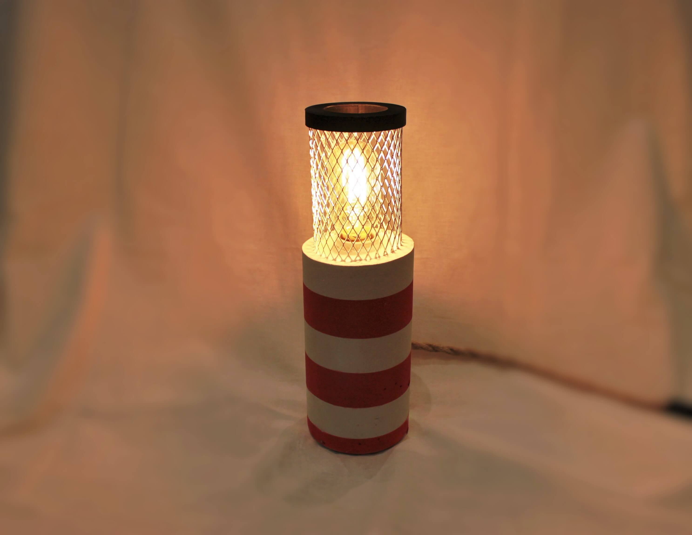

## Collections By Date

### Merrylegs  December 2018

    
    

        
        
    

### 5955  January 2019

    
    

### Diana Ross  January 2019

    
    
    

### Layer Cake  March 2019

    
    

### Crackhead  July 2019

    

        
        
    

    

        
        
    

### German Bright  August 2019

    
    

### Trinity  August 2019

    

        
        
    

    

        
        
    

    

        
        
    

    

        
        
    

    

        
        
    

    

        
        
    

    

        
        
    

### Bubbles  October 2019

    

        
        
    

    

        
        
    

### Seychelles  January 2020

    
    

        
        
    

    

        
        
    

### Rainbow  March 2020

    

        
        
    

    

        
        
    

### Metro  February 2020

    
    

        
        
    

    

        
        
    

    

        
        
    

### Occupation  February 2020

    
    
    

        
        
    

    
    

        
        
    

    

        
        
    

### Tube Runner  February 2020

    
    

        
        
    

    
    

        
        
    

### Lighthouse  February 2020

    
    

        
        
    

    

        
        
    

    

