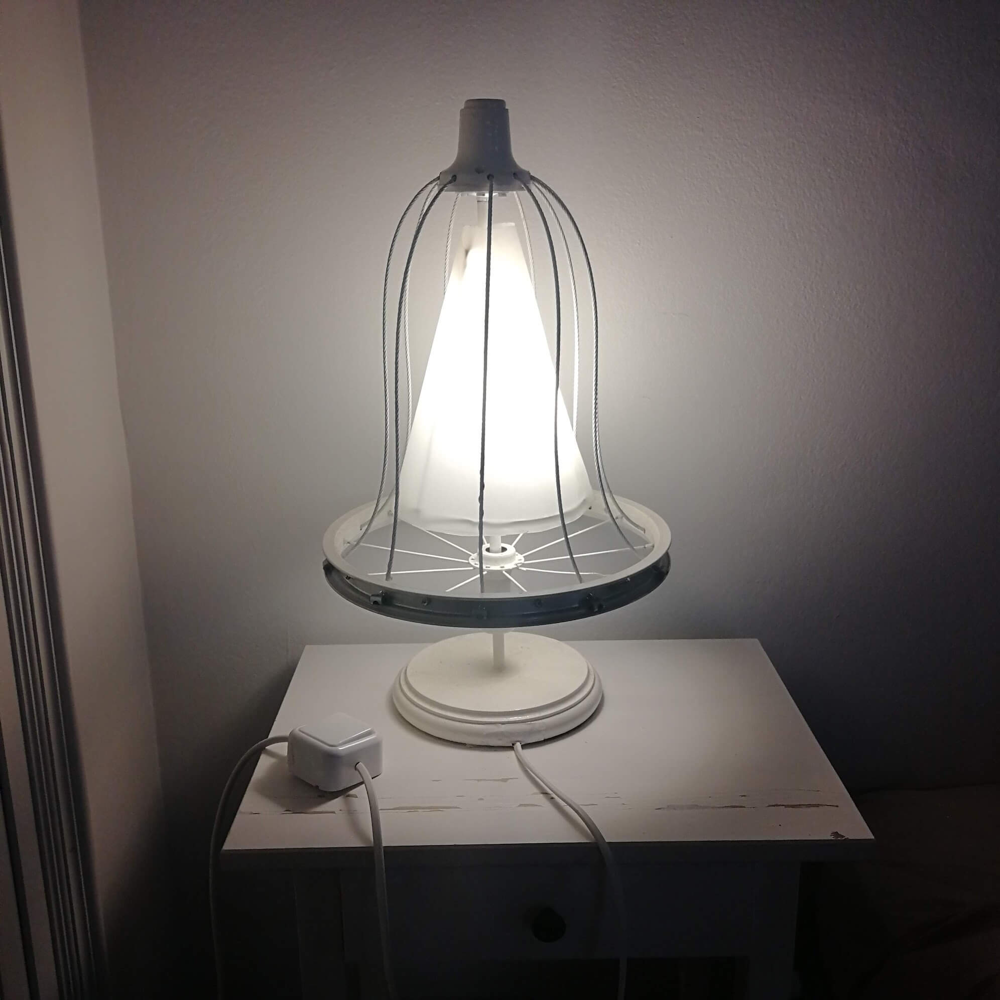
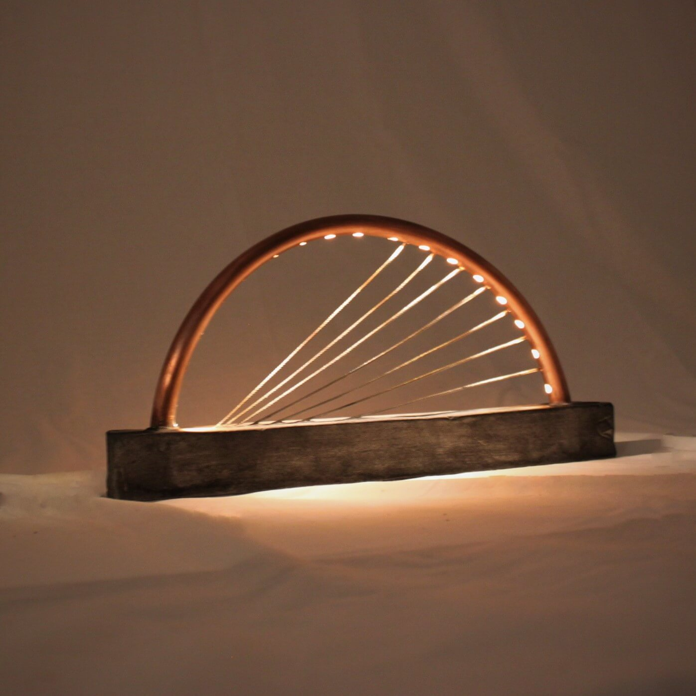
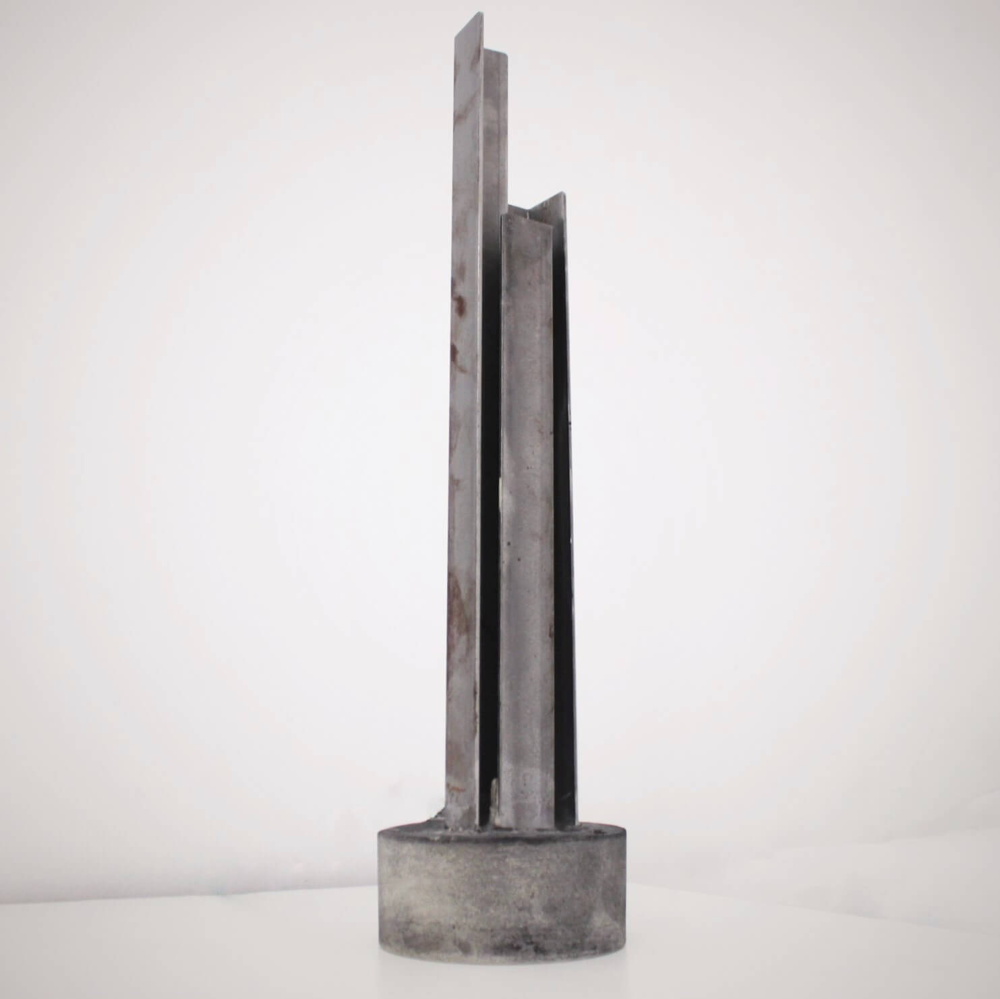

  <h2>Merrylegs</h2>
  
Dec 2018

  

    Merrylegs was the first lamp I made. Alicia gave me a box of things which included the bike wheel and I decided to make something with it. The wheel spins freely around the lamp and creates a nice pattern on the wall.
  

  

    
    
    
  

  <h2>5955</h2>
  
Jan 2019

  

    
    
  

  <h2>Diana Ross</h2>
  
Jan 2019

  
    
    
    
  

  <h2>Layer Cake</h2>
  
Mar 2019

  

    
    
  

  <h2>Crackhead</h2>
  
Jul 2019

  

    

      
      
    

    

      
      
    

  

  <h2>German Bright</h2>
  
Aug 2019

  

    
    
  

  <h2>Trinity</h2>
  
Aug 2019

  

    Trinity was the first series of lamps, and it was when I started developing more of a process for making batches of lamps with consistent dimensions. The lamps all feature a central concrete block and 12 steel poles, the idea was to make the usually cold and hard materials look more natural and lightweight.
  

  

    
    
    
    
    
    
    
    
    
    
    
    
    
    
  

  <figcaption>
    From top. Trinity, Riot Van, Sputnik, Jellyfish, A1.
  </figcaption>

  <h2>Bubbles</h2>
  
Oct 2019

  

    Bubbles was a continuation of some ideas I'd had while building Crackhead. It was more of a move towards sculpture than a useful lamp, and the curves were a bit of a pain to make consistently.
  

  

    
    
    
    
  

  <h2>Seychelles</h2>
  
Jan 2020

  

    
    
    
    
    
  

  <h2>Rainbow</h2>
  
Mar 2020

  

    
    
    
    
  

  <h2>Metro</h2>
  
Feb 2020

  

    
    
    
    
    
    
    
  

  <h2>Occupation</h2>
  
May 2020

  

    Occupation was a series of work made over the Covid quarantine, forged from the pits of extereme boredom. They were unvieled at the Inside Out art exhibition in summer 2020.
     
     
    The Chase features 10 switches wired in series meaning you have a 1/1024 chance of turning it on correctly. It gave anyone with enough patience plenty of choices at a time when there wasn't a lot else to do.
     
     
    Pointless is a bulb surrounded by a 6cm wide concrete block. The bulb can never be replaced, but it doesn't matter cause it's not connected. The LED strip along the top shines down on the blub in all it's pointless glory
     
     
    Tipping Point places a real light bulb between a concrete base and pyrmid giving the impression everything will come crashing down. It's the same view 360 degrees around, and works with some reinforcments drilled into the bulb.

  

  

    
    
    
    
    
    
    
    
    
  

  <h2>Tube Runner</h2>
  
Aug 2020

  

    
    
    
  

  <h2>Zero</h2>
  
Jan 2021

  

    
    
    
  

  <h2>Lighthouse</h2>
  
Sep 2020

  

    
    
    
    
    
    
  

  <h2>Colour Wheel</h2>
  
Sep 2020

  

    The installation takes the simple concept of the colour wheel and turns it into a ever changing and trancy light show.
     
     
    The four LED tubes provide the four main colours of the colour wheel around the edges of a freely suspended white circle. The colours blend and mix to produce the full spectrum of colours across the central circle, and various sequences are programmed to run in order to highlight the possibilities of different blends of colour.
  

  

    
    
    
    
  

  

    
    
  

  

    
  

