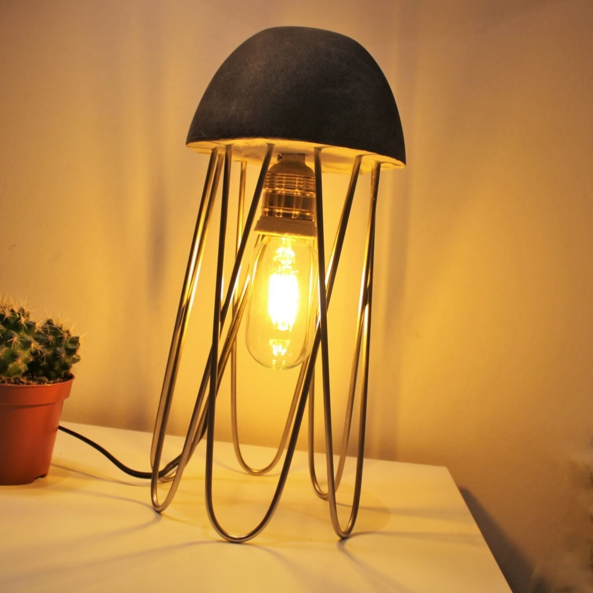
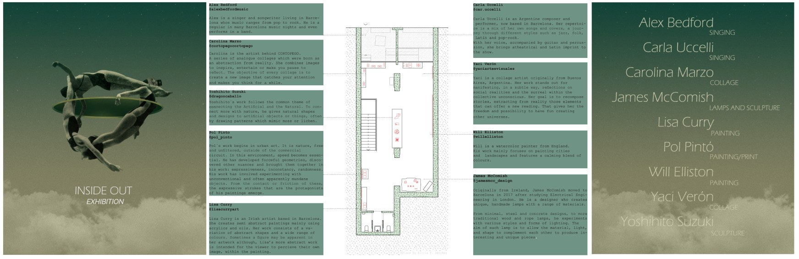

I moved to Barcelona in summer 2017 without much of a plan, mostly because it was a nice place, I heard it was good for startups, and Ben was moving back after having lived there the year before. For a few months I drifted around and done random things to avoid having to get an actual job. I would fix up furniture that I found on the street and sell it on a second hand site, I worked part time at a Japanese restaurant (Koku), and I spent a lot of time reading. Eventually (about 4 months later) I completely ran out of money and had to move back to London, where I went to uni, for a few months to work on a project to earn enough to live in Barcelona some more. 

When I came back I finally got an actual job working as an engineer at a startup called Roboyo. Although I’d spend about 35 of my first 52 weeks at Roboyo travelling for work, I kept up my interest in furniture and tried to build what I could over the weekends when I was in Barcelona. Alicia was moving out of her flat so she left a box of stuff with me, and since she was an architect, the box had some cool tools and materials in it. One of the best things was a small bicycle wheel which I thought could be made into something fun. After a few weekends messing about with it and other items from the box, the obvious thing to build was a lamp.  

<figure style="display: flex; flex-direction: column; align-items: center; width: 100%;">
    
    <figcaption>The first lamp I made, courtesy of a wheel from Alicia</figcaption>
</figure>

Since I had to buy some tools and lamp paraphernalia for this project, I decided I’d put them to good use by building a few other lamps too. These other ideas required even more tools, and so again I messed about with building more lamps which I’d sketched out along the way. Eventually I started designing in CAD and experimenting with new materials like steel and concrete. The first series which transitioned from hacking together random objects and towards a more serious design process featured lamps made from 12 steel poles arranged around a concrete block. The series was called Trinity cause the initial design was supposed to be like a mushroom cloud from an explosion, but that looked awful as a lamp so I scrapped it but kept the name. They ended up being more jellyfish-like by the end, and it was fun to make the heavy materials appear to kinda float. 

  

    
    
    
    

<figcaption>4 Lamps from the Trinity series. Clockwise TL: Riot Van, Jellyfish, Sputnik, A1</figcaption>

By the end of 2019 the lamps had levelled up from a hobby to a side income, and I was selling them and attending a lot of design events and markets around Barcelona. The lamps themselves were getting more adventurous, and since people were actually buying them, the process of making them had to get a lot better too. Both those things were problems cause I was still working out of my bedroom. I had a corner dedicated to setting concrete, a desk for cutting metal, and then decided that I needed a second workbench for assembly more than a bed, so I sold that and built a standing desk with a 70cm wide truck bed below for sleeping. 

    
    
    

<figcaption>My bed / workbench when I started building bigger lamps.</figcaption>

It was a ridiculous setup, and it was about this time that Ben was starting to regret convincing me to move to Barcelona. I went from building small beside table lamps to building larger sculptures over 1m tall, and my storage space spilled over from my room into the kitchen. I had reduced my hours at Roboyo to 5h a day, so I would generally work from 9am-2pm, cycle home, have lunch, work on the lamps until I was told to stop making noise (generally about 11pm), then move onto to CAD or contacting stores to buy lamps until about 1am. I was wrecked, so I decided that I was going to quit my job to go all in on the lamps and was looking into renting, and living in, a dedicated workspace anywhere I could find one. Thankfully I didn’t find one before March 2020, cause people stopped ordering lamps, all design events were cancelled, and pretty much everything shut down cause of the pandemic. 

Since everything was closed I had a lot of free time, and since I was still working part-time for Roboyo I had enough money to get by, so overall I had a pretty great lockdown. I used those months to experiment with more wacky designs and move a lot of my process to CAD as I couldn’t easily buy parts. I bought a 3D printer and started building parts for lamps, and getting ready for bigger designs when the shops reopened. (Again, gotta feel for Ben here, 2 months of lockdown + 3D printer noises drove him mad). Over these months I produced a series of work called Occupation, which was a collection of weird pieces aimed to highlight the boredom and unease felt over those months. 

    <figcaption>Occupation: A collection of lamps and sculptures made during lockdown</figcaption>

I met some great arty people at events over the previous couple of years, and I noticed that they also had work inspired by their time in lockdown. I knew someone with a bar/gallery who was willing to open for an event, so decided to organise an exhibition where 6 of us displayed our work in summer 2020. By some miracle the event fell during the week the government lifted lockdown restrictions, and before they realised that was an awful idea and shut everything down again. We managed to have about 100 people show up to the opening, and it was one of the few events that summer that actually worked out, very lucky. 

<figcaption>Booklet for the Inside Out exhibition</figcaption>

Coming out of the lockdowns at the end of 2020, I was shifting away from the more ‘normal’ lamps and towards larger installations for events or commercial spaces. This was partly due to the loss of momentum in sales and the sad fact that many small design shops had closed permanently. But it was also a direction I was excited about, and I was having fun building the larger work. I was starting to build some of the ideas I’d had while locked up, which again raised the question about moving into a dedicated workspace.  

<figcaption>Colour Wheel: An installation built for an event in Barcelona, September 2020</figcaption>

I was as excited about going full time on the lamps as before, and reevaluated the idea of moving into a workshop dedicated to the new larger lamps, but in the end I never did. I applied to build installations for a few light festivals around Barcelona and northern Spain in early 2021 which would have provided funding to get off the ground, but due to another wave of covid, they were all cancelled. It was not certain when events like this would become normal again, and I wasn’t financially in a position to take the risk of going full time without them. I decided to put the larger work on hold, and continued to make some of the smaller series for friends who were still putting in orders, but eventually put that on hold too. 

 

 

<figcaption>Tube Runner (Aug 2020), Metro (June2020), Zero (Jan 2021) </figcaption>

While playing about with the 3D printer I started to have fun with programming again after having moved away from engineering at Roboyo when I went part time a few years before. When I realised I wasn't going to push ahead with the lamps, I was open to doing something new, and took some time in mid 2021 to again drift around and read a bit. I briefly entertained the idea of studying physics and even started getting back into maths to prep. It was an even worse financial decision than the lamps so obviously didn't go ahead, but it did lead me to a conversation with Peter that was the beginning of another project, [Socii](../socii). 

The lamps were a great project and certainly one of the most enjoyable ways I have ever earned money in my life. Playing about with new materials, making parts with the 3D printer, and seeing people actually buy some of the experiments that worked was fun.

 When people ask I still say the lamp work is on hold, I do plan to get back into this at some point, but it's likely a lot of years away, and I'm not sure wtf lamps are going to look like by then. If you ever bought a lamp or gave feedback on one, thank you very much for the support, and if you'd like to put in a long-term pre-order for the return, please get in touch.   
  