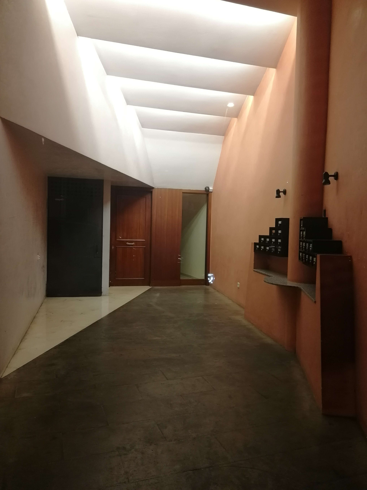
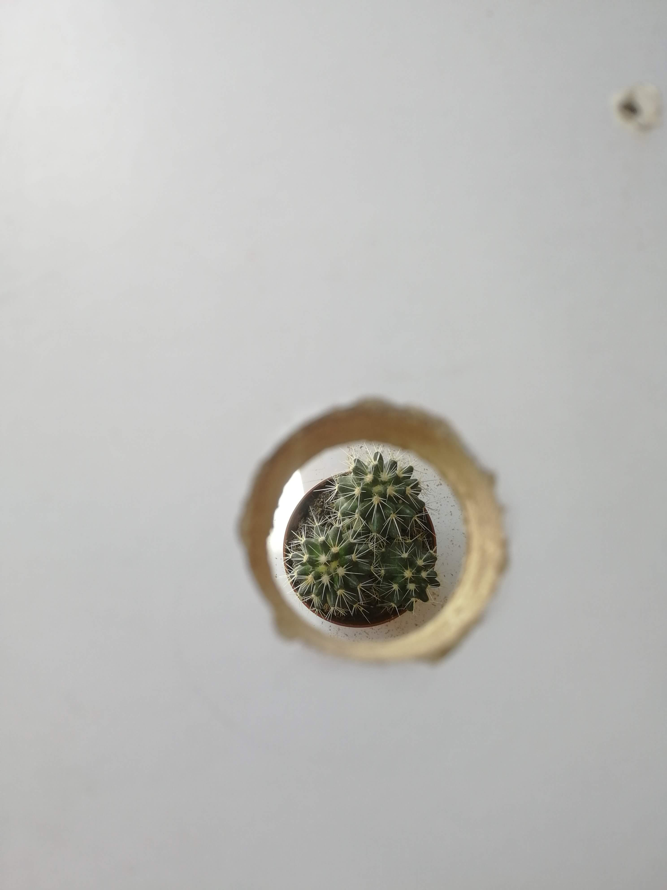
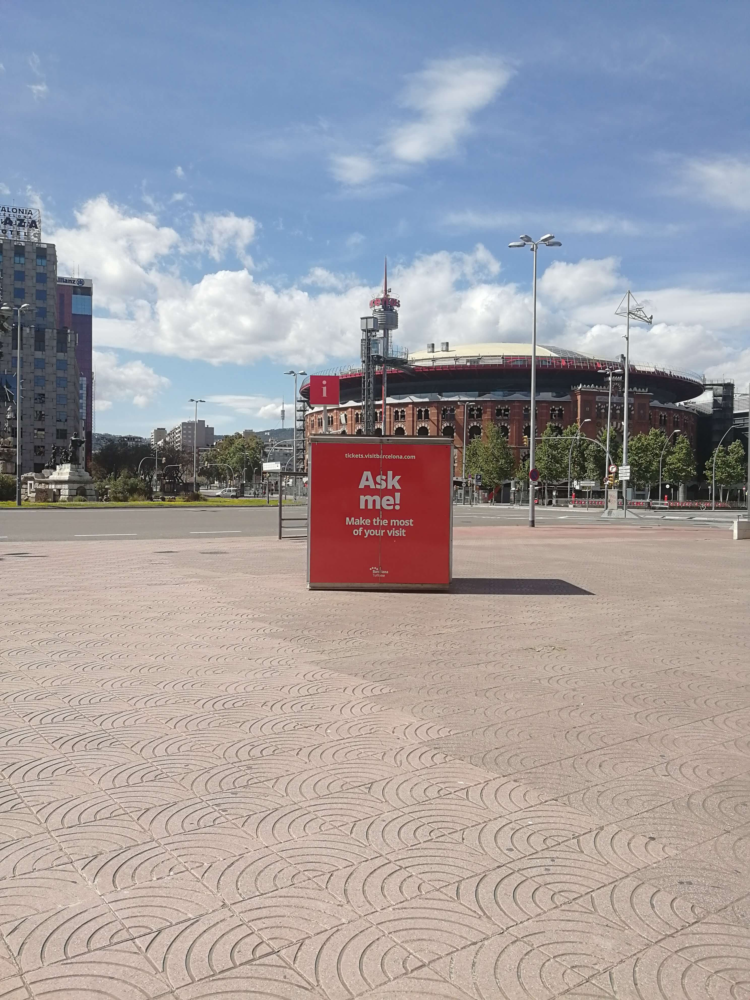
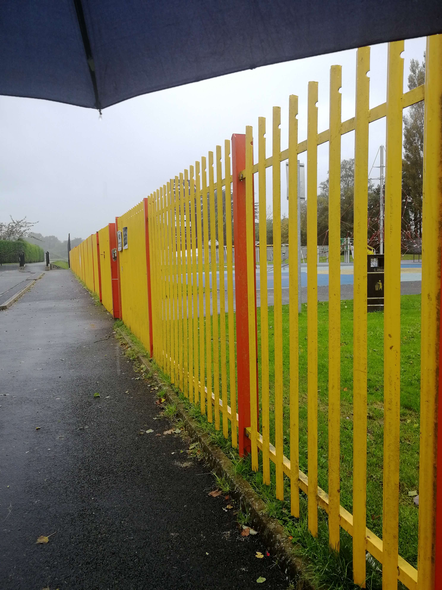
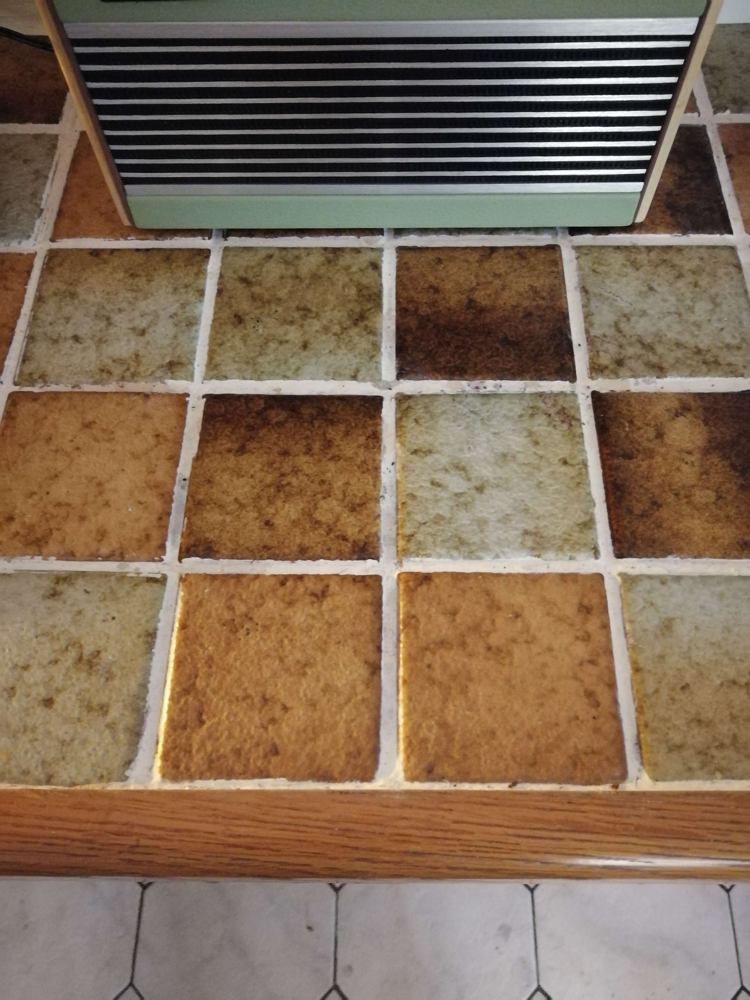

At the beginning of 2020 I decided that I would take one photo per day for the entire year. There was no specific intention for the photos, and I wasn't sure if it would be a project to improve my photography, act as a diary, or track progress over the year – I also didn't expect to spend so much of the year locked inside, and probably would have been disappointed if I knew in advance that on a total of 11 days, the most interesting thing I could take a picture of was whatever I ate for dinner.

In the end the results are a mixed bag of mediocre photography, well arranged but otherwise mundane objects, slightly aesthetic moments of my day, or whichever single frame was the most suitable image to sum up the important events of that day.

I should also say that I managed to miss a few days, giving a total of 360 photos - the fact that it's a leap year makes this slightly more of a failure then it would have been most years.

All pics are unedited and shot with a 2018 Huawei Honor 9 phone. I've put 12 of them below, and if you're bored you can see the rest <a target="_blank" href="https://drive.google.com/drive/folders/1rWe9iwW4dvN-wenIMZorUx2-BLgQus3l?usp=sharing">here</a>

    

        
        <figcaption>January 1</figcaption>
    

    

        
        <figcaption>January 12</figcaption>
    

    

        
        <figcaption>February 6</figcaption>
    

    

        
        <figcaption>March 1</figcaption>
    

    

        
        <figcaption>April 4</figcaption>
    

    

        
        <figcaption>April 19</figcaption>
    

    

        
        <figcaption>April 25</figcaption>
    

    

        
        <figcaption>June 6</figcaption>
    

    

        
        <figcaption>June 27</figcaption>
    

    

        
        <figcaption>September 25</figcaption>
    

    

        
        <figcaption>November 1</figcaption>
    

    

        
        <figcaption>December 15</figcaption>
    

