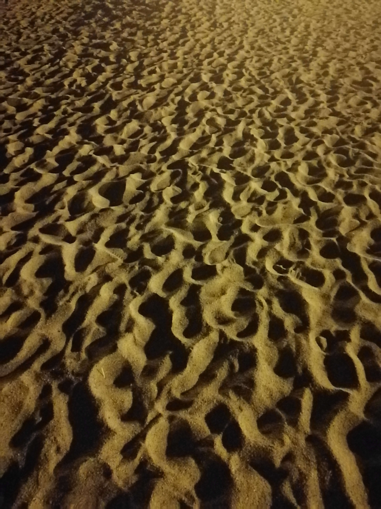
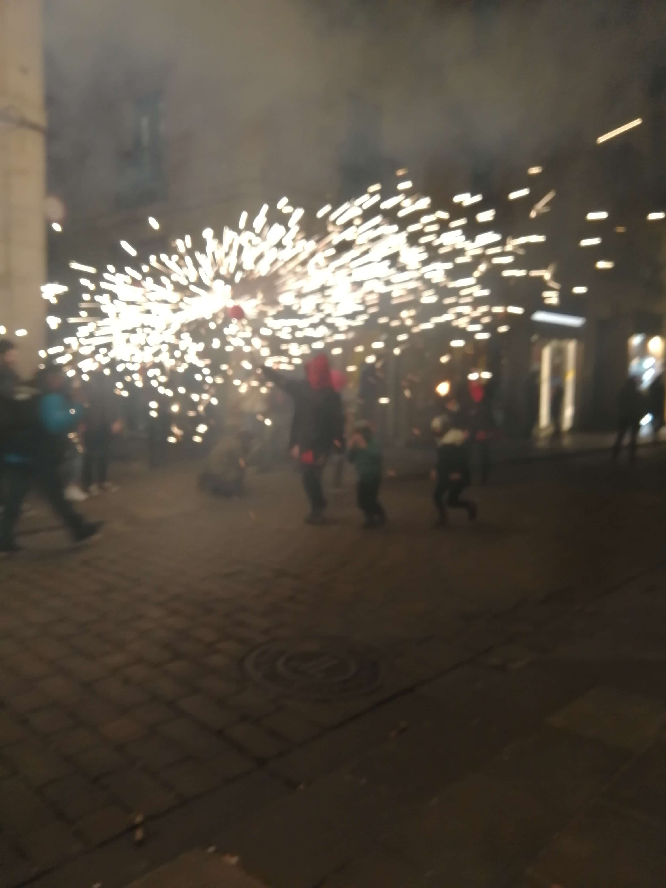
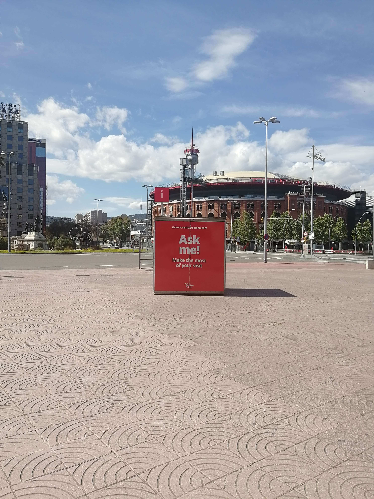

At the beginning of 2020 I decided that I would take one photo per day for the entire year. There was no specific intention for the photos, and I wasn't sure if it would be a project to improve my photography, act as a diary, or track progress over the year – I also didn't expect to spend so much of the year locked inside, and probably would have been disappointed if I knew in advance that on a total of 11 days, the most interesting thing I could take a picture of was whatever I ate for dinner.

I don’t think that knowing these things in advance would have been enough to put me off, and I’m glad I went ahead with it. In the end the results are a mixed bag of mediocre photography, well arranged but otherwise mundane objects, slightly aesthetic moments of my day, or whichever single frame was the most suitable image to sum up the important events of that day.

    

        
        <figcaption>January 1</figcaption>
    

    

        
        <figcaption>January 12</figcaption>
    

A candid picture of a pattern in the sand which took just slightly above zero effort on the way to swim on January 1st was the start of the collection. I figured that with relatively little commitment I could record 365 more things worth looking at over the next 12 months, and with any luck they would be at least some way pleasing to look back on once complete.

Travelling was one activity that was obviously limited, but a trip to London and a few visits to Ireland did go ahead. Ideas to visit 4 new countries, travel round the Baltics, and go to Moscow all fell away quickly. Actually the only goal completed related to travel was to get 4 trips back to Ireland over the course of the year. Despite 3 of them featuring funerals, and one being extended due to flight cancellations (contributing to the total of 35 pictures taken in Ireland), overall they were pretty positive.

Although travel did take a hit, the consolation to lockdowns and restricted movement was that Barcelona is a relatively nice place to be trapped. Sun, plenty of parks, and the sea made things comfortable for most of the time. During the more intense weeks of confinement, trying to get the hang of 3D printing (see May 20th), and a few Zoom quizes (March 30th) helped pass time.

    

        
        <figcaption>February 6</figcaption>
    

    

        
        <figcaption>March 1</figcaption>
    

It turned out that 13 more photos would include beaches, and that instead of being effortless, I found it increasingly difficult to avoid taking the same picture twice, or desperately settle for a picture of the wall of my bedroom after forgetting to take a picture that day (unfortunately neither was avoided - there are a few similar pictures and at least 3 which are of my room). The distinction between an exercise in photography and diary keeping was blurred throughout, but overall the photos did keep quite a reasonable track of the my plans for the year, and all the main activities I spend most of my time were represented at least once.

Amongst th​e pictures which aimed to document work or travel you'll find some which are harder to categorize, like the regal looking seagull below (June 27th). He's joined by a set of photos that includes 4 car parks, 2 cups of tea, 6 stairways, 2 umbrellas, and a tooth. 

    

        
        <figcaption>June 27</figcaption>
    

    

        
        <figcaption>September 25</figcaption>
    

I should also say that I managed to miss a few days, giving a total of 360 photos - the fact that it's a leap year makes this slightly more of a failure then it would have been most years. But although a few pictures are missing, I feel overall it was worthwhile and the collection is sprinkled with some decent photos, nice memories, and reminders of a pretty weird year.

All pics are unedited and shot with a 2018 Huawei Honor 9 phone. 12 of them are on this page, and if you're bored you can see the rest <a target="_blank" href="https://drive.google.com/drive/folders/1rWe9iwW4dvN-wenIMZorUx2-BLgQus3l?usp=sharing">here</a>

    

        
        <figcaption>April 4</figcaption>
    

    

        
        <figcaption>April 19</figcaption>
    

    

        
        <figcaption>April 25</figcaption>
    

    

        
        <figcaption>June 6</figcaption>
    

    

        
        <figcaption>November 1</figcaption>
    

    

        
        <figcaption>December 15</figcaption>
    

