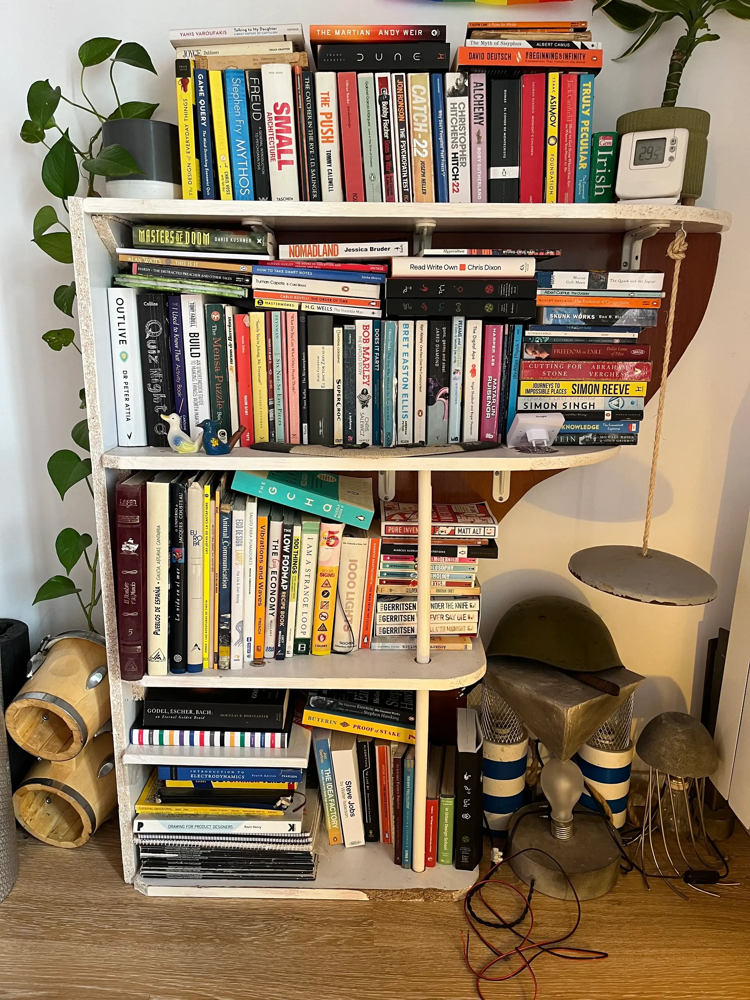

When I moved away from Barcelona in 2024 I had to pack up my bookshelf. It was made from a pile of driftwood I found in the street, extended with a gong, and had collected most of the books I'd read over the 7 years I'd lived there. I shared the below picture to Farcaster and asked if based on those books, anyone could recommend me what to read next. The response was pretty amazing an I ended up ordering a few of the suggestions. 

That made me think it might be worth doing a more complete digital version. 

